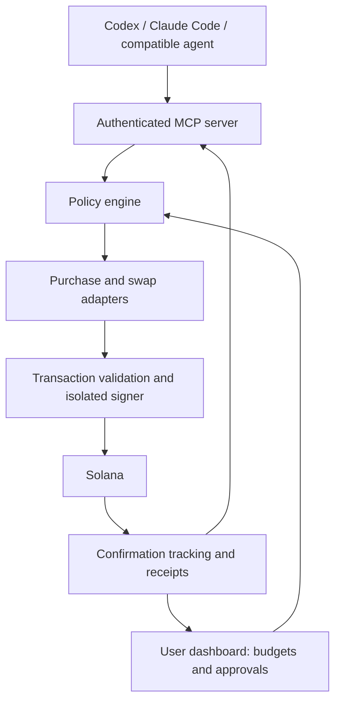

# Solpouch
A Solana wallet for your AI.
Build an “AI spending account”: a Solana wallet that Codex, Claude Code, or another compatible agent can use within limits you control.
The pitch: “Give your AI a budget, connect your preferred assistant, and let it buy services, swap tokens, and manage funds—with a receipt for every action.”
For a hackathon, I’d outline it like this:
1. The user experience
A user opens your dashboard, connects their wallet, and funds a separate agent wallet. Its token holdings form the agent’s portfolio.
They configure rules such as:
“You have 20 USDC. Spend up to 2 USDC daily on approved APIs. Propose SOL/USDC swaps, but ask me before executing them.”

Then they connect your tool to their assistant and give instructions normally:
- “Show my balances and available spending budget.”
- “Buy access to this dataset and analyze it.”
- “Quote a swap of 5 USDC into SOL.”
- “Show everything you purchased for this task.”
Connecting a normal wallet alone does not grant autonomous spending authority. Funding and authorizing the agent wallet is a separate step.
2. One connection for multiple AI tools
Expose your capabilities through MCP, a standard interface through which assistants call external tools. Both Codex and Claude Code support MCP servers, making it a practical integration point. Other clients would need compatible MCP support or an API adapter. Codex documentation, Claude Code documentation
Your initial tool set could be:
Tool	Purpose
get_portfolio	Return balances, estimated values, and available budget
quote_purchase	Return merchant, resource, price, and payment details
quote_swap	Return expected output, fees, and minimum received
request_action	Submit a purchase, transfer, or swap for policy checks
get_action_status	Return approval state, execution status, and receipt

The assistant receives scoped access to these tools. Private keys remain outside its context and accessible filesystem. Each AI client may also apply its own tool approval requirements.
3. Three core capabilities
Capability	Hackathon implementation	Later expansion
Buy services	Purchase access to one paid API you operate	Approved API, compute, and data providers
Trade tokens	Quote SOL/USDC swaps and demonstrate the approval flow	Execute approved swaps and rebalance within explicit rules
Manage funds	View balances, budgets, and transaction history	Recurring payments and separate budgets per agent

For purchases, x402 supports paying for HTTP resources using Solana. Start with a compatible paid API; arbitrary online stores require additional merchant integrations. Solana x402 documentation
For trading, Jupiter’s Swap API supplies routing and transaction construction, so you can integrate an existing exchange mechanism. Jupiter documentation
4. The architecture

The AI proposes an action. Your backend determines whether it is allowed, validates the exact transaction, and signs only after the necessary authorization.
For the hackathon, a backend signer holding a disposable development wallet is a manageable implementation. That is a custodial prototype: the backend controls its key. A production version could use constrained signing infrastructure or an audited on-chain vault.
5. Make spending controls the main feature
The useful distinction is that limits are enforced in code, independently of the assistant’s prompt.
Control	Example
Purchase budget	Maximum 2 USDC per day across all connected agents
Trade limit	Maximum 5 USDC equivalent per swap, with separate trading turnover limits
Allowed destinations	Only registered merchants and approved recipients
Allowed assets	Specific SOL/USDC mint addresses
Execution bounds	Maximum fees, slippage, and quote age
Approval	Trades require approval of the exact proposed action
Revocation	Disable future signing immediately

Reserve budget atomically before execution, so two agents cannot simultaneously spend the same remaining allowance. Use unique action IDs so retries cannot charge twice. Revocation stops future actions; it cannot undo completed transactions.
6. A realistic hackathon scope
Assuming a small team and roughly 48 hours, build:
- A dashboard with balances, rules, pending approvals, and activity.
- An MCP connection tested with one assistant.
- One working paid API purchase using test funds.
- Swap quotes and a clearly labelled paper-trading execution flow.
- A successful purchase, a blocked overspend, and a receipt visible in the demo.
Use TypeScript for the dashboard, backend, and MCP server, plus a database for budgets and action records. Keep simulated trading separate from actual on-chain balances. Verify network support for each payment or swap integration before promising a devnet execution demo.
7. The demo story
“I give Claude a small research budget. It buys a dataset and produces an analysis. I switch to Codex, which sees the same remaining balance and receipts. Codex proposes a token swap. The dashboard requests my approval. An attempt to exceed the budget is rejected.”

That demonstrates the central product: a shared financial account for AI assistants, with enforceable permissions and traceable actions. Frequent small purchases give you the transaction-volume angle; model interoperability and reliable spending controls give you the strongest hackathon story.
