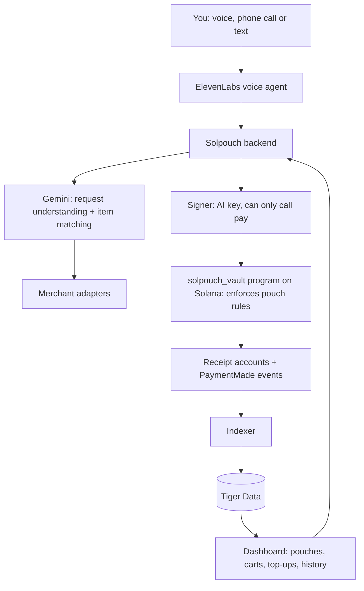

# Solpouch

**Budget pouches your AI shops from, and can't refill.**

Backend hardening is documented in [BACKEND-HARDENING.md](BACKEND-HARDENING.md): wallet sign-in and explicit ownership are required; chain mode is a single-owner devnet demo. Voice supports signed, wallet-scoped sessions once provider tool headers are configured; the live sign-in integration is pending the collaborator’s source.

Split your money into pouches (Uber Eats, groceries, fun money, job-site supplies), each held by our own Solana program with its own limits. Tell Solpouch what you need, by voice or text. It finds the items, shows you exactly what it found, and buys only after you confirm. When a pouch is empty, it's empty: the AI can't top it up, and neither can you without deliberately going to the app and adding money.

Built at StormHacks 2026 · [solpouch.tech](https://solpouch.tech)

> **Status:** in development. Setup instructions will be added as the code lands.

---

## Who it's for

**Students and anyone on a budget.** Budgeting apps only *track* overspending after it happens. Solpouch makes the budget real: the Uber Eats pouch holds $40 for the month, and when it's gone, the AI says no. Topping up takes a conscious, slightly annoying step, on purpose.

**Trades, construction and small-business owners.** Ordering in bulk from supplier websites is slow and confusing, especially if you'd rather just make a phone call. Say *"200 2x4s, 8 feet, and ten boxes of 3-inch deck screws, delivered to the site Tuesday"* and Solpouch builds the order, reads it back line by line, and places it from the job's pouch once you say yes.

## How it works

1. **Create pouches.** Each pouch is an account in the Solpouch vault program, holding its own USDC, with its own rules: what it's for, where it can spend, the max per order, and whether purchases need your confirmation.
2. **Fill them, deliberately.** Adding money only happens in the app, through a top-up flow with built-in friction: re-authenticate, type the amount, wait out a short cooldown, and say why. The AI has no way to add money or move it between pouches.
3. **Ask for what you need.** "Get me Thai food under $20." "Restock the usual groceries." "Order the materials list for the Kim job."
4. **Check what it found.** Before anything is bought, Solpouch shows and reads back each item: name, brand, size, quantity, unit price, total and store, with anything it changed flagged ("oat milk was out, I picked Silk instead").
5. **Confirm, and it pays.** Say yes and it pays from the right pouch. Every purchase gets a receipt with a Solana Explorer link.
6. **When it's empty, it's empty.** "Your fun money pouch has $3 left until the 1st. Want to open the app and top it up?"

## Making sure it bought the right thing

The AI never buys straight from your request. Every order goes through a check step:

- **Structured match.** Gemini compares each found item to what you asked for, field by field (product, brand, size, quantity, unit price), and gives each line a match score.
- **Flagged differences.** Substitutions, price jumps and anything below the match threshold are called out in red and read out loud.
- **Explicit confirmation.** You approve the exact cart: the same items and total that will be paid. If anything changes after you approve, it asks again.
- **After delivery (stretch goal).** Snap a photo of the receipt or the delivered items, and Gemini checks them against the order.

## The vault: our own Solana program

Solpouch doesn't use a wallet service. Pouches live in `solpouch_vault`, a Solana program we wrote in Rust with Anchor, so **the blockchain enforces the rules, not our server.**

| Instruction | Who can call it | What the program checks |
|---|---|---|
| `create_pouch` | Owner | Name, AI key, limits, allowed merchants (up to 10) |
| `top_up` | **Owner only** | Moves USDC from the owner's wallet into the pouch |
| `pay` | The AI's key | Not frozen, merchant allowed, under max per order, under the daily limit, enough funds, order ID never used before |
| `set_rules`, `freeze`, `unfreeze`, `withdraw`, `close_pouch` | Owner only | |

The AI's key can only call `pay`. There's no instruction that lets it refill a pouch, withdraw, or move money between pouches. So an empty pouch stays empty even if our backend or the AI misbehaves, and a leaked AI key can spend at most one pouch's daily limit, at allowed merchants only.

Every payment creates an on-chain receipt account keyed by the order ID, so the same order can never be paid twice.

**Accounts**

| Account | Seeds | Holds |
|---|---|---|
| `Pouch` | `["pouch", owner, name]` | Owner, AI key, mint, limits, allowed merchants, spent today, frozen |
| Vault | `["vault", pouch]` | The pouch's USDC, controlled only by the program |
| `Receipt` | `["receipt", pouch, order_id]` | Merchant, amount, time |

## Built with

| Technology | Role |
|---|---|
| **Solana** | Our own `solpouch_vault` program (Rust + Anchor) holding every pouch and enforcing its rules, Solana Pay checkout, on-chain receipts |
| **ElevenLabs** | Voice ordering and voice read-back of every cart, including a phone-call mode for people who'd rather just call |
| **Gemini** | Understands requests, finds and matches products, scores how well each item matches, explains substitutions |
| **Tiger Data** | Postgres + TimescaleDB, fed by an indexer that listens to the vault program's events: orders and receipts, spending per pouch over time, price history for repeat bulk items |
| **TypeScript / Next.js** | Backend and dashboard |
| **MCP** | Optional: let Claude Code, Codex or another assistant shop from a pouch under the same rules |

## Architecture

**Life of one order**

1. You ask for something. Gemini turns it into a structured shopping list and picks the pouch.
2. Merchant adapters find candidate items. Gemini scores each one against your request.
3. Solpouch shows and reads the cart back. You confirm the exact cart.
4. The backend calls `pay` on the vault program with the AI's key and a unique order ID.
5. The program checks the pouch's rules on-chain and either pays the merchant or rejects the transaction.
6. The indexer picks up the payment event and writes it to Tiger Data for history and charts.

## Pouch rules

| Rule | Example |
|---|---|
| Purpose | "Uber Eats", "Groceries", "Fun money", "Kim job: materials" |
| Allowed merchants | Uber Eats pouch can only buy Uber Eats |
| Max per order | $25 for food, $2,000 for job materials |
| Confirmation | Always, or only above an amount |
| Refill | **Owner only**, enforced by the program. The app adds friction on top |
| Moving money between pouches | Owner only (withdraw, then top up), same friction |
| Freeze | "Freeze my pouches" sets the on-chain freeze flag; every `pay` fails until unfrozen |

## Where it can buy

| Where | How |
|---|---|
| Merchants that accept Solana | Pays directly with Solana Pay, fully automatic after confirmation |
| Stores that don't accept crypto (Uber Eats, grocery chains, hardware stores) | Buys a gift card for that store with crypto, then uses it |
| Our demo merchants | A grocery store and a building-supply store that accept Solana Pay on devnet |

## Hackathon scope

- Dashboard: create pouches, set rules, top up with friction, view carts and history
- The `solpouch_vault` program deployed to devnet, with tests for every rule, and our own test USDC token
- Voice ordering with cart read-back and voice confirmation
- Gemini item matching with substitutions flagged
- Two demo merchants (grocery, building supply) with Solana Pay checkout
- Spending-per-pouch charts from Tiger Data
- In the demo: a confirmed order, a caught substitution, an empty pouch refusing to spend, the chain itself rejecting an over-limit payment sent from outside the app, and a bulk order placed by voice

**Stretch goals:** real gift-card purchases with real SOL, receipt-photo verification after delivery, a phone number you can call to place orders, MCP access for coding assistants.

## Security notes

The pouch rules are enforced by our on-chain program. The current devnet demo backend holds both the owner key and the restricted AI payment key; production wallet-signed owner transactions are not implemented. The program is unaudited hackathon code running on devnet with a test USDC token. A production version would need an audit, a hardware-backed signer for the AI key and a regulated on-ramp for bank top-ups. Revocation stops future purchases; it can't undo completed ones.
