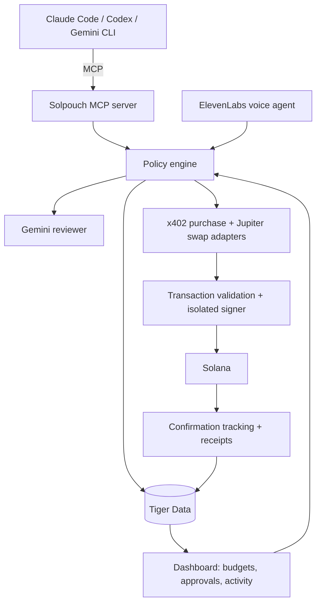

# Solpouch

**A Solana wallet for your AI.**

Give your AI a budget, connect your preferred assistant, and let it buy services, swap tokens and manage funds, with a receipt for every action. Big decisions get approved by voice.

Built at StormHacks 2026.

> **Status:** in development. Setup instructions will be added as the code lands.

---

## How it works

1. **Fund an agent wallet.** Connect your own wallet in the dashboard and fund a separate agent wallet. Its token holdings are the agent's portfolio. Connecting a normal wallet never grants spending authority; funding and authorizing the agent wallet is a separate, explicit step.
2. **Set the rules.** For example: *"You have 20 USDC. Spend up to 2 USDC a day on approved APIs. Propose SOL/USDC swaps, but ask me before executing them."*
3. **Connect your assistants.** Claude Code, Codex and Gemini CLI all connect to the same Solpouch MCP server, so they share one balance, one budget and one receipt history.
4. **Talk to it normally.**
   - "Show my balances and available spending budget."
   - "Buy access to this dataset and analyze it."
   - "Quote a swap of 5 USDC into SOL."
   - "Show everything you purchased for this task."
5. **Approve by voice.** When an action needs your OK, Solpouch says so out loud: *"Codex wants to swap 5 USDC for about 0.03 SOL, approve?"* Answer yes or no, ask what your agents spent today, or say "freeze everything."

## Built with

| Technology | Role |
|---|---|
| **Solana** | Agent wallet, USDC payments for paid APIs via [x402](https://www.x402.org), swap quotes via [Jupiter](https://dev.jup.ag/), on-chain receipts |
| **ElevenLabs** | Voice agent for approvals, balance questions and the freeze command |
| **Gemini** | Reviews every action and explains it in plain English; powers the voice agent; Gemini CLI is a supported assistant |
| **Tiger Data** | Postgres + TimescaleDB: atomic budget reservations, action and receipt history, price and balance time-series, live spend charts from continuous aggregates |
| **MCP** | One integration point for every assistant |
| **TypeScript / Next.js** | Backend, MCP server and dashboard |

## Architecture

**Life of one action**

1. An assistant calls `request_action` with a unique action ID.
2. The policy engine checks the merchant, asset, limits, quote age, fees and slippage.
3. The budget is reserved atomically in the database, so two agents can never spend the same remaining allowance.
4. Gemini reviews the action against the task and recent history and adds a plain-English note and risk flag. This is advisory only; limits are enforced in code, never by a prompt.
5. Small, in-policy purchases execute right away. Anything over the threshold, and every swap, waits for approval by voice or in the dashboard.
6. On approval, the backend re-validates the exact transaction, signs, sends, records the receipt and settles the reservation. Denied or expired actions release their reservation.

## MCP tools

| Tool | Purpose |
|---|---|
| `get_portfolio` | Balances, estimated values and remaining budget |
| `quote_purchase` | Merchant, resource, price and payment details |
| `quote_swap` | Expected output, fees and minimum received |
| `request_action` | Submit a purchase, transfer or swap for policy checks |
| `get_action_status` | Approval state, execution status and receipt |
| `list_receipts` | Everything purchased for a task or session |

Assistants get scoped access to these tools only. Private keys never enter an assistant's context or reachable filesystem.

## Spending controls

Limits are enforced in code, independently of anything the assistant is told.

| Control | Example |
|---|---|
| Purchase budget | Max 2 USDC per day across all connected agents |
| Per-action limit | Anything over 1 USDC needs approval |
| Trade limit | Max 5 USDC equivalent per swap, plus a turnover limit |
| Allowed destinations | Registered merchants and approved recipients only |
| Allowed assets | Specific SOL and USDC mint addresses |
| Execution bounds | Max fees, slippage and quote age |
| Approval | Swaps require approval of the exact proposed transaction |
| Idempotency | Unique action IDs, so a retry can never charge twice |
| Revocation | "Freeze everything" stops all future signing immediately |

Revocation stops future actions; it can't undo completed transactions.

## Hackathon scope

- Dashboard with balances, rules, pending approvals, activity and live spend charts
- MCP server tested with Claude Code, Codex and Gemini CLI
- A working paid-API purchase over x402 with devnet funds
- SOL/USDC swap quotes with a clearly labelled paper-trading execution flow (Jupiter runs on mainnet only)
- Voice approvals and a voice freeze switch
- In the demo: a successful purchase, a blocked overspend and a receipt with a Solana Explorer link

**Stretch goals:** real-world spending through crypto gift cards, voice-confirmed grocery checkout, separate budgets per agent.

## Demo story

> I give Claude a small research budget. It buys a dataset and produces an analysis. I switch to Codex, which sees the same remaining balance and receipts. Codex proposes a token swap, and Solpouch asks me out loud to approve it. Gemini CLI tries to go over the budget and is rejected. I say "freeze everything" and all signing stops.

## Security notes

This is a **custodial prototype**: the backend holds the key for a disposable development wallet. A production version would use constrained signing infrastructure or an audited on-chain vault. Keep simulated trades separate from real on-chain balances.
