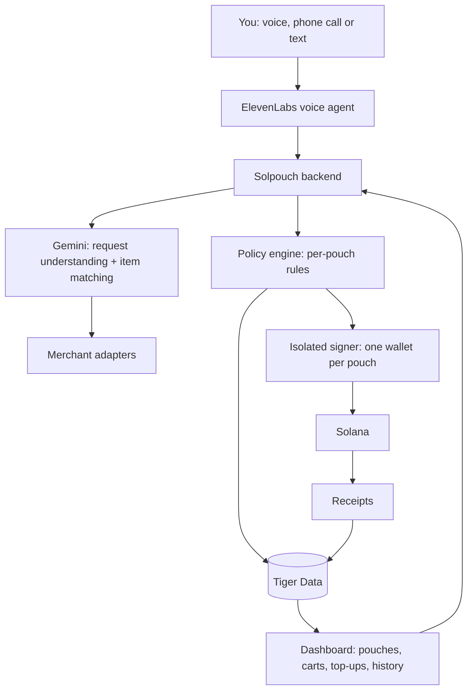

# Solpouch

**Budget pouches your AI shops from, and can't refill.**

Split your money into pouches (Uber Eats, groceries, fun money, job-site supplies), each a separate Solana wallet with its own limits. Tell Solpouch what you need, by voice or text. It finds the items, shows you exactly what it found, and buys only after you confirm. When a pouch is empty, it's empty: the AI can't top it up, and neither can you without deliberately going to the app and adding money.

Built at StormHacks 2026 · [solpouch.tech](https://solpouch.tech)

> **Status:** in development. Setup instructions will be added as the code lands.

---

## Who it's for

**Students and anyone on a budget.** Budgeting apps only *track* overspending after it happens. Solpouch makes the budget real: the Uber Eats pouch holds $40 for the month, and when it's gone, the AI says no. Topping up takes a conscious, slightly annoying step, on purpose.

**Trades, construction and small-business owners.** Ordering in bulk from supplier websites is slow and confusing, especially if you'd rather just make a phone call. Say *"200 2x4s, 8 feet, and ten boxes of 3-inch deck screws, delivered to the site Tuesday"* and Solpouch builds the order, reads it back line by line, and places it from the job's pouch once you say yes.

## How it works

1. **Create pouches.** Each pouch is its own Solana wallet with its own rules: what it's for, where it can spend, the max per order, and whether purchases need your confirmation.
2. **Fill them, deliberately.** Adding money only happens in the app, through a top-up flow with built-in friction: re-authenticate, type the amount, wait out a short cooldown, and say why. The AI has no way to add money or move it between pouches.
3. **Ask for what you need.** "Get me Thai food under $20." "Restock the usual groceries." "Order the materials list for the Kim job."
4. **Check what it found.** Before anything is bought, Solpouch shows and reads back each item: name, brand, size, quantity, unit price, total and store, with anything it changed flagged ("oat milk was out, I picked Silk instead").
5. **Confirm, and it pays.** Say yes and it pays from the right pouch. Every purchase gets a receipt with a Solana Explorer link.
6. **When it's empty, it's empty.** "Your fun money pouch has $3 left until the 1st. Want to open the app and top it up?"

## Making sure it bought the right thing

The AI never buys straight from your request. Every order goes through a check step:

- **Structured match.** Gemini compares each found item to what you asked for, field by field (product, brand, size, quantity, unit price), and gives each line a match score.
- **Flagged differences.** Substitutions, price jumps and anything below the match threshold are called out in red and read out loud.
- **Explicit confirmation.** You approve the exact cart: the same items and total that will be paid. If anything changes after you approve, it asks again.
- **After delivery (stretch goal).** Snap a photo of the receipt or the delivered items, and Gemini checks them against the order.

## Built with

| Technology | Role |
|---|---|
| **Solana** | One wallet per pouch, USDC payments via Solana Pay, on-chain receipts |
| **ElevenLabs** | Voice ordering and voice read-back of every cart, including a phone-call mode for people who'd rather just call |
| **Gemini** | Understands requests, finds and matches products, scores how well each item matches, explains substitutions |
| **Tiger Data** | Postgres + TimescaleDB: pouches and rules, orders and receipts, spending per pouch over time, price history for repeat bulk items |
| **TypeScript / Next.js** | Backend and dashboard |
| **MCP** | Optional: let Claude Code, Codex or another assistant shop from a pouch under the same rules |

## Architecture

**Life of one order**

1. You ask for something. Gemini turns it into a structured shopping list and picks the pouch.
2. Merchant adapters find candidate items. Gemini scores each one against your request.
3. The policy engine checks that pouch's rules: allowed merchant, max per order, remaining balance.
4. The amount is reserved atomically, so two orders can't spend the same money.
5. Solpouch shows and reads the cart back. You confirm the exact cart.
6. The backend re-validates, signs from that pouch's wallet only, pays, and stores the receipt.

## Pouch rules

| Rule | Example |
|---|---|
| Purpose | "Uber Eats", "Groceries", "Fun money", "Kim job: materials" |
| Allowed merchants | Uber Eats pouch can only buy Uber Eats |
| Max per order | $25 for food, $2,000 for job materials |
| Confirmation | Always, or only above an amount |
| Refill | **User only**, through the friction top-up. The AI has no refill or transfer tool |
| Moving money between pouches | User only, same friction |
| Freeze | "Freeze my pouches" stops all spending immediately |

## Where it can buy

| Where | How |
|---|---|
| Merchants that accept Solana | Pays directly with Solana Pay, fully automatic after confirmation |
| Stores that don't accept crypto (Uber Eats, grocery chains, hardware stores) | Buys a gift card for that store with crypto, then uses it |
| Our demo merchants | A grocery store and a building-supply store that accept Solana Pay on devnet |

## Hackathon scope

- Dashboard: create pouches, set rules, top up with friction, view carts and history
- One Solana wallet per pouch on devnet, with the AI unable to refill or transfer
- Voice ordering with cart read-back and voice confirmation
- Gemini item matching with substitutions flagged
- Two demo merchants (grocery, building supply) with Solana Pay checkout
- Spending-per-pouch charts from Tiger Data
- In the demo: a confirmed order, a caught substitution, an empty pouch refusing to spend, and a bulk order placed by voice

**Stretch goals:** real gift-card purchases with real SOL, receipt-photo verification after delivery, a phone number you can call to place orders, MCP access for coding assistants.

## Security notes

This is a **custodial prototype**: the backend holds disposable devnet keys for each pouch. A production version would use constrained signing infrastructure or an audited on-chain vault, and a regulated on-ramp for bank top-ups. Revocation stops future purchases; it can't undo completed ones.
