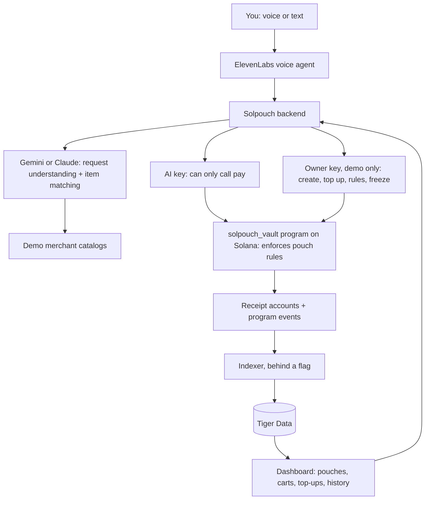

# Solpouch

**Budget pouches your AI shops from, and can't refill.**

Split your money into pouches (Uber Eats, groceries, fun money, job-site supplies), each held by our own Solana program with its own limits. Tell Solpouch what you need, by voice or text. It finds the items, shows you exactly what it found, and buys only after you confirm. When a pouch is empty, it's empty: the AI can't top it up, and neither can you without deliberately going to the app and adding money. (In this demo build the backend signs owner actions; see [Security notes](#security-notes).)

Built at StormHacks 2026 · [solpouch.tech](https://solpouch.tech)

> **Status:** in development, running on Solana devnet with a test USDC token. To run it locally, see [STATUS.md → Run it](STATUS.md#run-it).

---

## Who it's for

**Students and anyone on a budget.** Budgeting apps only *track* overspending after it happens. Solpouch makes the budget real: the Uber Eats pouch holds $40 for the month, and when it's gone, the AI says no. Topping up takes a conscious, slightly annoying step, on purpose.

**Trades, construction and small-business owners.** Ordering in bulk from supplier websites is slow and confusing, especially if you'd rather just make a phone call. Say *"200 2x4s, 8 feet, and ten boxes of 3-inch deck screws, delivered to the site Tuesday"* and Solpouch builds the order, reads it back line by line, and places it from the job's pouch once you say yes.

## How it works

1. **Create pouches.** Each pouch is an account in the Solpouch vault program, holding its own USDC, with its own rules: what it's for, where it can spend, the max per order, and whether purchases need your confirmation.
2. **Fill them, deliberately.** Adding money only happens in the app, through a top-up flow with built-in friction: link your wallet, type the amount, wait out a short cooldown, and optionally note why. The AI's key has no way to add money or move it between pouches.
3. **Ask for what you need.** "Get me Thai food under $20." "Restock the usual groceries." "Order the materials list for the Kim job."
4. **Check what it found.** Before anything is bought, Solpouch shows and reads back each item: name, brand, size, quantity, unit price, total and store, with anything it changed flagged ("oat milk was out, I picked Silk instead").
5. **Confirm, and it pays.** Say yes and it pays from the right pouch. Every purchase gets a receipt with a Solana Explorer link.
6. **When it's empty, it's empty.** "Your fun money pouch has $3 left until the 1st. Want to open the app and top it up?"

## Making sure it bought the right thing

The AI never buys straight from your request. Every order goes through a check step:

- **Structured match.** The AI (Gemini or Claude) compares each found item to what you asked for, field by field (product, brand, size, quantity, unit price), and gives each line a match score.
- **Flagged differences.** Substitutions, price jumps and anything below the match threshold are called out in red and read out loud.
- **Explicit confirmation.** You approve the exact cart: the same items and total that will be paid. If anything changes after you approve, it asks again.
- **After delivery (planned / stretch).** Snap a photo of the receipt or the delivered items, and the AI checks them against the order. Not built yet.

## The vault: our own Solana program

Solpouch doesn't use a wallet service. Pouches live in `solpouch_vault`, a Solana program we wrote in Rust with Anchor, so **the blockchain enforces the rules, not our server.**

| Instruction | Who can call it | What the program checks |
|---|---|---|
| `create_pouch` | Owner | Name, AI key, limits, allowed merchants (up to 10). Max per order ≤ daily limit, amounts > 0, AI key ≠ owner, no duplicate merchants |
| `top_up` | **Owner only** | Moves USDC from the owner's wallet into the pouch |
| `pay` | The AI's key | In order: not frozen, merchant allowed (by the token account's owner), under max per order, under the daily limit, enough funds, order ID never used before |
| `set_rules`, `freeze`, `unfreeze` | Owner only | `set_rules` gets the same rule sanity checks |
| `withdraw`, `close_pouch` | Owner only | On-chain only; not exposed in the app yet |

The AI's key can only call `pay`. There's no instruction that lets it refill a pouch, withdraw, or move money between pouches. A leaked AI key can spend at most one pouch's daily limit, at allowed merchants only.

The daily limit covers a 24-hour window, not a calendar day. The first window opens when the pouch is created; after a window ends, the next payment resets the count and opens a new one. Lowering the limit below what's already spent is allowed; further payments are then refused.

Every payment creates an on-chain receipt account keyed by the order ID, so the same order can never be paid twice.

**Accounts**

| Account | Seeds | Holds |
|---|---|---|
| `Pouch` | `["pouch", owner, name]` | Owner, AI key, mint, limits, allowed merchants, spent in the current 24-hour window, window start, frozen |
| Vault | `["vault", pouch]` | The pouch's USDC, controlled only by the program |
| `Receipt` | `["receipt", pouch, order_id]` | Merchant, amount, time |

## Built with

| Technology | Role |
|---|---|
| **Solana** | Our own `solpouch_vault` program (Rust + Anchor) holding every pouch and enforcing its rules, on-chain receipts. Solana Pay checkout is planned |
| **ElevenLabs** | Voice ordering and voice read-back of every cart. A phone-call mode is planned |
| **Gemini or Claude** | Understands requests, finds and matches products, scores how well each item matches, explains substitutions |
| **Tiger Data** | Postgres + TimescaleDB: orders, receipts and spending per pouch over time. An indexer can read the vault program's events into it (behind a flag) |
| **TypeScript / Next.js** | Backend and dashboard |
| **MCP** | Planned / stretch: let Claude Code, Codex or another assistant shop from a pouch under the same rules |

## Architecture

**Life of one order**

1. You ask for something. The AI turns it into a structured shopping list and picks the pouch.
2. It looks up candidate items in the demo merchants' catalogs and scores each one against your request.
3. Solpouch shows and reads the cart back. You confirm the exact cart.
4. The backend calls `pay` on the vault program, signed by the AI's key, with a unique order ID.
5. The program checks the pouch's rules on-chain and either pays the merchant or rejects the transaction.
6. The order and receipt are saved to Tiger Data for history and charts. With the indexer on, it also reads the payment event from chain.

## Pouch rules

| Rule | Example |
|---|---|
| Purpose | "Uber Eats", "Groceries", "Fun money", "Kim job: materials" |
| Allowed merchants | Uber Eats pouch can only buy Uber Eats |
| Max per order | $25 for food, $2,000 for job materials. Can't exceed the daily limit |
| Daily limit | 24-hour windows: the first opens when the pouch is created, each later one at the first payment after the previous one ends |
| Confirmation | Always, or only above an amount (small exact catalog matches auto-confirm) |
| Refill | **Owner only**, enforced by the program. The app adds friction on top |
| Moving money between pouches | Owner only (withdraw, then top up). `withdraw` exists on-chain but isn't in the app yet |
| Freeze | "Freeze my pouches" sets the on-chain freeze flag; every `pay` fails until unfrozen |

## Where it can buy

| Where | How |
|---|---|
| Our demo merchants (built) | A grocery store and a building-supply store. Each is a fixed devnet address with a JSON catalog, paid by the vault's `pay` after you confirm |
| Web search / "any store" (partial) | Produces a search-based estimate and hands checkout off to the retailer. Solpouch doesn't pay these orders |
| Instacart (partial) | Builds a shopping-list link. It never charges anything |
| Merchants that accept Solana (planned / stretch) | Pay directly with Solana Pay. No Solana Pay integration yet |
| Stores that don't accept crypto (planned / stretch) | Buy a gift card for that store with crypto, then use it. Not built |

## Hackathon scope

- Dashboard: create pouches, set rules, top up with friction, view carts and history
- The `solpouch_vault` program deployed to devnet, with tests for every rule, and our own test USDC token
- Voice ordering with cart read-back and voice confirmation
- Gemini or Claude item matching with substitutions flagged
- Two demo merchants (grocery, building supply), paid through the vault program
- Spending-per-pouch charts from Tiger Data
- In the demo: a confirmed order, a caught substitution, an empty pouch refusing to spend, the chain itself rejecting an over-limit payment sent from outside the app, and a bulk order placed by voice

**Planned / stretch:** Solana Pay checkout, real gift-card purchases, paying web and "any store" orders, receipt-photo verification after delivery, a phone number you can call to place orders, MCP access for coding assistants, withdraw and close in the app, and per-user wallet signing (below).

## Security notes

The pouch rules are enforced by our on-chain program, and the AI's key can only call `pay`, within each pouch's limits.

**Custody today (demo).** Every pouch is seeded with one owner keypair that the backend holds (`OWNER_KEYPAIR_PATH`). That key signs `create_pouch`, `top_up`, `set_rules` and `freeze` for every user, and pays fees for `pay`. Which user owns which pouch is tracked only in our database, by email. So in the demo the backend *can* refill or freeze any pouch. This is devnet with test USDC only. The AI's key path is still limited to `pay` by the program, and the on-chain rules still bind it.

**Planned fix.** Each user signs owner actions (create, top up, rules, withdraw) from their own wallet, and pouches are seeded with the user's wallet, so the backend holds only the AI's key. Linking a wallet (signing a challenge to prove you own it, required before top-ups) is being added first; it doesn't sign transactions yet.

The program is unaudited hackathon code running on devnet with a test USDC token. A production version would need an audit, a hardware-backed signer for the AI key and a regulated on-ramp for bank top-ups. Revocation stops future purchases; it can't undo completed ones.
